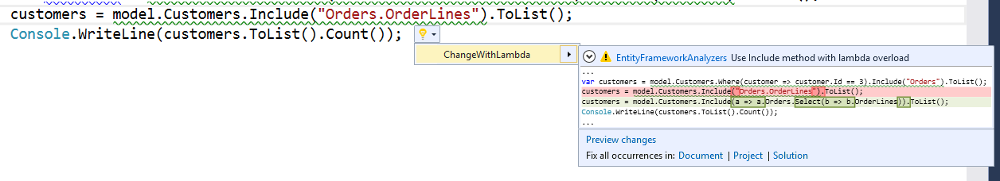

# Entity Framework Analyzers

Code Analyzers and Fixers for Common Entity Framework Issues built by [.NET Compiler Platform ("Roslyn")](https://github.com/dotnet/roslyn)

Currently there is only one analyzer available: 

**Use Include with lambda**
> Use Include method with lambda overload. This provides compile time validation and refactoring support

###How to get it

Entity Framework Analyzers is available on Nuget: https://www.nuget.org/packages/EntityFrameworkAnalyzers/
